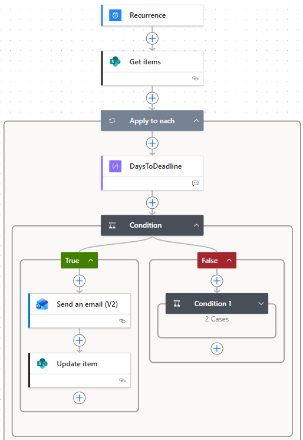
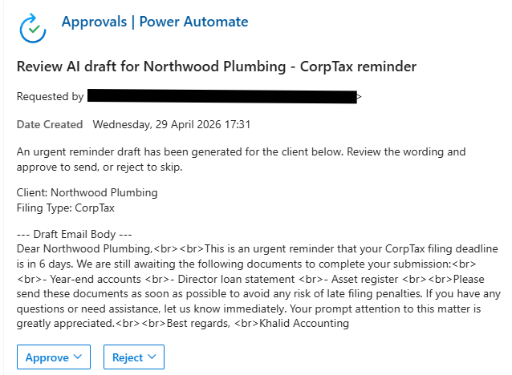
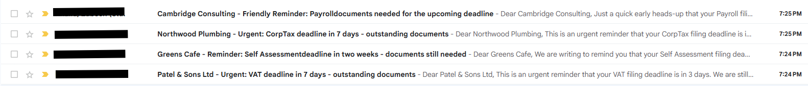

# Power Automate AI Document Chase System

---

## Context

A small London-based accounting practice with 80 clients was spending 
around 6 hours per week manually chasing clients for documents needed 
to complete VAT returns, payroll, self-assessment, and corporation tax 
filings ahead of HMRC deadlines.

Their existing reminder software sent the same generic email to every 
client every 15 days regardless of urgency. There was no central tracker, 
no audit trail, and no way to escalate as deadlines approached.

> *"If clients just gave me their data on time, I could do my best work. 
Instead, I spend half my energy chasing, and the other half rushing."*
> — Practice Owner

---

## Action — What I Did

Designed and built a scheduled Power Automate cloud flow that runs every 
morning at 8am, reads a SharePoint client tracker, calculates days 
remaining to each filing deadline, and automatically drafts and routes 
a personalised reminder email in the right tone for each client.

The system has 6 components:

- **SharePoint ClientFilingTracker** — single source of truth storing 
  client name, email, filing type, deadline, documents expected, 
  documents received, status, and reminder stage
- **Scheduled daily flow** — processes only incomplete filings, 
  ignoring finished ones to avoid wasted AI credits
- **Tiered escalation logic** — three nested conditions route each 
  client into exactly one tier based on days to deadline
- **AI Builder prompts** — generates a fresh personalised email per 
  client in the correct tone for their tier
- **Human approval gate** — urgent messages (7 days or fewer) pause 
  for owner review before sending; lower-risk tiers send automatically
- **Audit trail** — every email sent and every approval decision is 
  timestamped back to the SharePoint row

### Escalation Tiers

| Days to Deadline | Tone | Approval Required |
|---|---|---|
| 30 days | Friendly heads-up | No |
| 14 days | Firm but courteous | No |
| 7 days or fewer | Urgent | Yes — human review |
| More than 30 days | No action | — |

---

## Skills Used

- **Microsoft Power Automate** — scheduled cloud flow, nested conditions, 
  Apply to each loop, Compose actions, dynamic expressions
- **AI Builder** — GPT-4.1 prompt actions with structured input variables, 
  tone control, output format constraints, and anti-hallucination guards
- **SharePoint** — list design, dynamic content wiring, status updates, 
  audit trail
- **Microsoft Approvals connector** — human-in-the-loop governance for 
  high-risk messages
- **Prompt Engineering** — three-tier prompt design with consistent 
  structure, explicit tone instructions, and length constraints
- **Responsible AI** — tiered governance model, data residency 
  compliance, UK GDPR and ISO 42001 alignment

---

## Impact

Based on the owner's baseline estimate of 6 hours per week spent 
chasing clients, the system was projected to reduce active chasing 
time to approximately 1 hour per week — recovering around 250 hours 
of staff capacity per year.

Against an estimated ongoing system cost of £50–75 per month, the 
projected return on recovered capacity alone is 7–10x.

Additional projected benefits:
- Earlier document arrival giving more time for proper filing review
- Reduced error risk on last-minute filings
- Full timestamped audit trail for HMRC compliance and client disputes
- Approval fatigue avoided by requiring human review only on the 
  highest-risk tier

---

## Evidence

### The full Power Automate flow

*End-to-end scheduled flow — Recurrence trigger through tiered 
escalation conditions to email send and SharePoint update*

---

### Human approval gate for urgent messages

*Owner receives an approval card showing the AI draft before any 
urgent email is sent — responsible AI built into the architecture, 
not added as an afterthought*

---

### Four AI-drafted emails with different tones, sent in one run

*Same flow, same morning — four clients, four personalised emails, 
four different tones based on deadline distance*

---

📁 [View all screenshots](./visuals/) — includes SharePoint tracker, 
AI Builder prompt configuration, approval audit trail, branch designs, 
and sample email outputs.

---

## Author

**Zubeen Khalid**
Data & AI Practitioner | MSc Applied Data Science (Distinction) | 
ISO 42001 Certified

[LinkedIn](https://www.linkedin.com/in/zubeenkhalid) · 
[GitHub](https://github.com/zubeen84)
